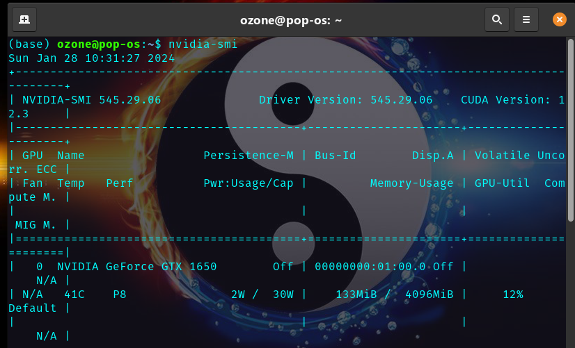
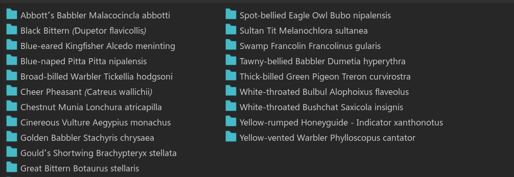
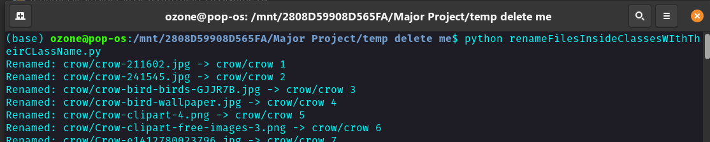
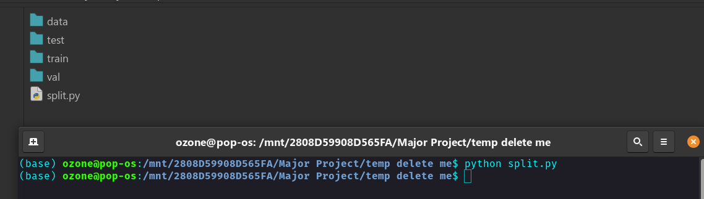
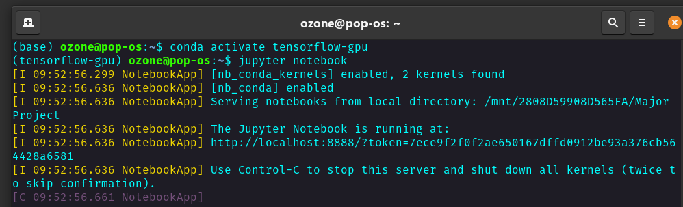
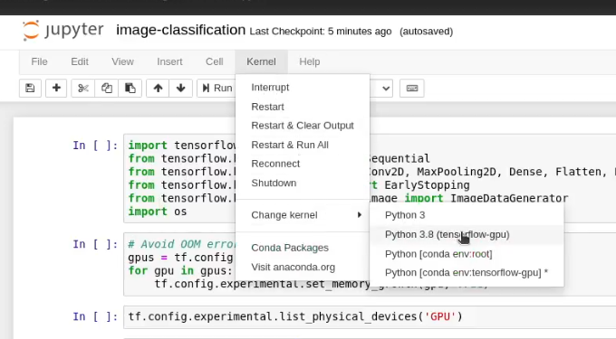

# 😀😃🥰
Welcome to Deep Lerning Model Training Toolkit. Donot worry, even if you are a rookie I will provide you full guidance on how to setup, build your own image classification model, test the model and deploy the model as well. I won't be like most of the people who just dump their code on github and lead you to void. I assure you that you can build your own model. I will be very precise and make you aware of any errors that I faced so you will get insights on how to solve those errors on your own. I will try to be informal as possible because I believe formality cannot let our brain explore the infinite. 

## Alternative
- If you just want to download and see the predictions of the model, Download the model from google drive : [Drive](https://drive.google.com/file/d/1iH9_p35WGNQXdwYQnyMpMQ60cwYJUWS8/view) .
-  Refer to my github repo to see what are the classes the model is able to predict;
[Link To Github](https://github.com/centaurusgod/CNN.ModelDeployment?tab=readme-ov-file#model-capabilities)

## Important
- This guide will be helpful to those who want to train the model using nvidia gpu's or integrated gpu. I donot have any idea on setting up Radeon GPUs to train the model, so you need to figure out that on your own.
- Using dedicated gpu will make the training extremly fast as compared to integrated GPU so it is recommended to use a dedicated graphics card for training.
- If you just want to see how it works and you donn't mind using dedicated GPU then you can directly jump to Step 3
- I feel its better to setup the python virtual environment and necessary packages first and later on setting up dedicated GPU as it will be easy for both the users.
- I have divided the steps into 4 categories
  1. Setting Up Environment
  2. Setting Up GPU
  3. Collecting Images(dataset) & How to place them in the directory 
  4. Model Training
## Step 1: Setting Virtual Environment & Necessary Packages
### Necessary tools & packages
1. Anaconda (highly recommended) Link: https://www.anaconda.com/ . Its a piece of cake setting up anaconda in windows, but if you are a linux user you might face small problems, but putting up small extra effort you can easily do so. 
   Watch this video to setup anaconda in linux ( assuming a debian distribution) : [Youtube Video](https://youtu.be/PHkCmuzgHOo)
2. Packages. You need the following packages, because we call different functions and methods from these packages in our code. The most important one is tensorflow.
- Python 3.8.0
- numpy  1.20.3
- matplotlib 3.7.0
- scikit-learn 1.3.2
- scipy 1.10.1
- tensorflow 2.10.0
3. jupyter notebook (Comes preinstalled with anaconda only)
### Anaconda Environment Setup with TensorFlow & other package dependencies

To set up an Anaconda environment with TensorFlow, follow these steps:

1. Create a new environment named 'tensorflow-gpu' with Python version 3.8:

    ```bash
    conda create --name tensorflow-gpu python=3.8
    ```

2. Activate the environment:

    ```bash
    conda activate tensorflow-gpu
    ```

3. Install TensorFlow version 2.10.0:

    ```bash
    pip install tensorflow==2.10.0
    ```

4. Enable notebook support in the environment:

    ```bash
    conda install -y -c conda-forge nb_conda
    ```

5. Add the environment to Jupyter Kernel:

    ```bash
    python -m ipykernel install --user --name tensorflow-gpu --display-name "Python 3.8 (tensorflow-gpu)"
    ```
6. Install the mentioned version of packages (As we already installed tensorflow and the required ython version, so we will not reinstall them. We will install other packages that I mentioned above. Please
   donot copy and paste the code below directly. I want to show you it's in the following format. Do that for packages that i mentioned above except tensorflow and python.
   ```bash
   pip install mentioned_package_name==mentioned_package_version
   ```
   - So for numpy
   ```bash
   pip install numpy==1.20.3
   ```
After opening Jupyter Notebook, change the kernel from Python to Python 3.8 (tensorflow-gpu).
(Image section) 

By this you must have sucessfully setup the environemnt required to run the notebook file. 
- If you are just seeing to know how it works then you are already good to go. Opening jupyter notebook file and running cells will work flawlessly..
  Open jupyter notebook
  - In windows you can just search jupyter notebook and navigate to theese file you downlaoded from github. 
  - In linux make sure the virtual environment is active. "tensorflow-gpu" in our case. Otherwise activate it using
  ```bash
  conda activate tensorflow-gpu
  ```
- If you want to train your custom images then you shall follow me further. 

## Step 2: Setting Up Dedcated GPU for training your images ( Nvidia only)
You need to have 2 things installed in your system whether it is windows or linux.
- cuda
- cuda-toolkit(you may need to signup to nvidia website to downlaod this)

**NVIDIA Setup For Windows**

1. Install the latest NVIDIA GPU driver for your device from [NVIDIA's official website](https://www.nvidia.com/Download/index.aspx).

### Version & OS Details
- **OS:** Windows 11 & Windows 10
- **Graphics Card:** Nvidia GTX 1650 4GB vRAM
- **CUDA Version:** 11.8
  - Download Link: [CUDA 11.8](https://developer.nvidia.com/cuda-11-8-0-download-archive)
- **cuDNN Version:** 8.7
  - Download Link: [cuDNN Archive](https://developer.nvidia.com/rdp/cudnn-archive#a-collapse870-118)
## Read
- Install CUDA first
- Extract cudnn archieve that you download
- Navigate to cuda installation directory. In our case, but make sure: `C:\Program Files\NVIDIA GPU Computing Toolkit\CUDA\v11.8\`
- It's better if you place two windows side by side. One of cuda folder and another of cudnn archieve extracted  files.
- Now one by one, go to folder inside extracted files of cudnn, copy it and place it inside same folder name of CUDA For example: Going to include folder of cudnn, copying all files and pasting them into same folder name include of cuda. 

***Do this, you won't regret***
To resolve the zlib.dll error, follow these steps:

1. Navigate to `C:\Program Files\NVIDIA Corporation\Nsight Systems 2022.4.2\host-windows-x64` and locate `zlib.dll`. Copy the file.

2. Go to `C:\Program Files\NVIDIA GPU Computing Toolkit\CUDA\v11.8\bin` and paste the copied file. Rename it from `zlib.dll` to `zlibwapi.dll`.

**NVIDIA Setup For Linux**

1. Make sure you have a proper functioning nvidia-driver in whichever distribution of linux you are. However you donot need to anything for PopOS if you have installed the one with nvidia drivers. Thanks to their out of the box hardware support. If u wanna use PopOS.  ISO:https://pop.system76.com/  Yiepee. Thanks to The PopOS developers. After installing  the nvidia driver, Check if the nvidia driver is working using the following command.

```bash
nvidia-smi
```
 
2. Installing cuda and cuda toolkit. Thanks again to the PopOS/system76 developers for mentioning easy way to install these in their website. If the following dont work for you, you might need to put extra effort to search and properly install cuda toolkit and cudnn in your linux system. Just do some research I am sure that you'll find solution. 
- Follow the link: https://support.system76.com/articles/cuda/

## Step 3 : Collecting & Preparing Images for training
### Image Collection
- If you want to collect images from google and build your own dataset, then use this [extention](https://chromewebstore.google.com/detail/download-all-images/ifipmflagepipjokmbdecpmjbibjnakm).
- It'd be better if you manually pick and crop the images found in google, yes it's kinda hard work but its totally worth it.
- Or for testing purposes you can use datasets found in **kaggle** and use it. You can skip following 1 step if you download image dataset from kaggle.But be sure of the naming convention of the folder that is used in kaggle. The **val** might have been named as **valid** or something else.
- 
### How to save these images?
  - For each individual class of images that you have collected you need to make a separate folderand place images belonging to that categories in the folder. For example if i collected images for apple, then i will make a folder named **Apples** and keep all the image sof apples there, same for all the images categories that you have downlaoded.
 
### Optional But Recommended ( Will be easy for testing & evaluation of model's prediction)
- Rename the image files inside classes(or folder names for example: rename all files inside apple folder with app1l1_1.jpg, apple_2.jpg etc)
  ```bash
  python renameFilesInsideClassesWIthTheirCLassName.py
  ```
   
### Splitting Images Into Test, Train & Validation Set
- First create a folder named data and place all the image folders that you have made earlier. Folder Structure. For example: data->apples
- Now time to open anaconda prompt or python in the directory where this project exists.
- You can see a file named split.py in the root directory where you have downlaoded this project. Or you can copy this script wherever your data folder exists. If your data folder exists in your Desktop, then copy this split.py in your desktop.
- Run the following command in anaconda prompt or python
  ```bash
  python split.py
  ```
   
- Note that  the current split for test-train-val is in the ratio of 9.0-0.05-0.05. If you want to change this, Open split.py in a text editor and change the valus of the following line. Take care the sum must be 1 btw.
  ```bash
  def split_data(input_folder, output_folder, train_ratio=0.9, val_ratio=0.05, test_ratio=0.05):
  ```
- After running this script you will see test, train and val folder.
- There will be some folders leftover in the **data** folder, so first we will go inside our data folder, cut those folders and place them in **train** folder.
- Finally cut the **train**,**test**, & **val** folder and place then inside the **data** folder.
- Hooray now we have prepared our dataset and it is ready to be trained.
## Step 4: Training & Building The Model
- There's a image-classification.ipynb file in this directory which contains code to train the model, as well as to save them.
- Activate the conda environemnt `conda activate tensorflow-gpu` or your python virtual environment. In windows you can dirctly search and open for jupyter notebook as well. For linux you need to open the terminal, activate the virtual environment and open jupyter notebook using the following command.
  ```bash
  conda activate tensorflow-gpu
  ```
  ```bash
  jupyter notebook
  ```
  
- Now from jupyter navigate to the directory where you have setup the data. Open image-classification.ipynb file. Note that the notebook file and the data file must be present in the same directory.
- **Very Important** Change your kernel in jupyter notebook from whatever you have to **tensorflow-gpu** 
- Now you are good to go. The code cells contains comments through which you will know what is happenning in each section of the code cell.
